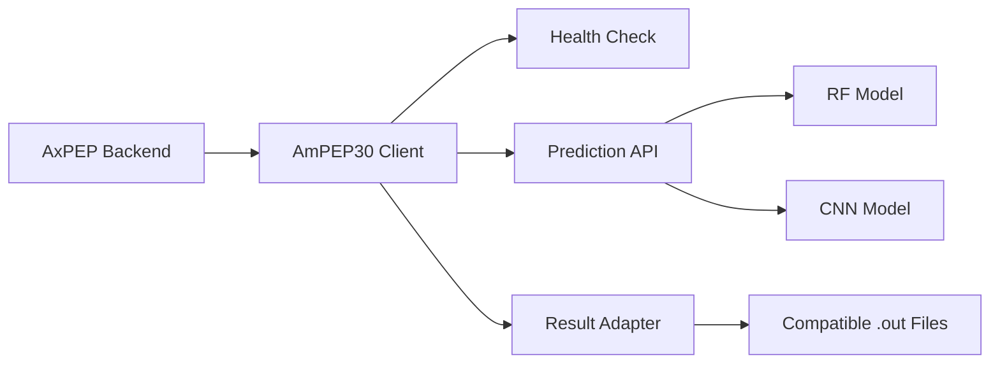
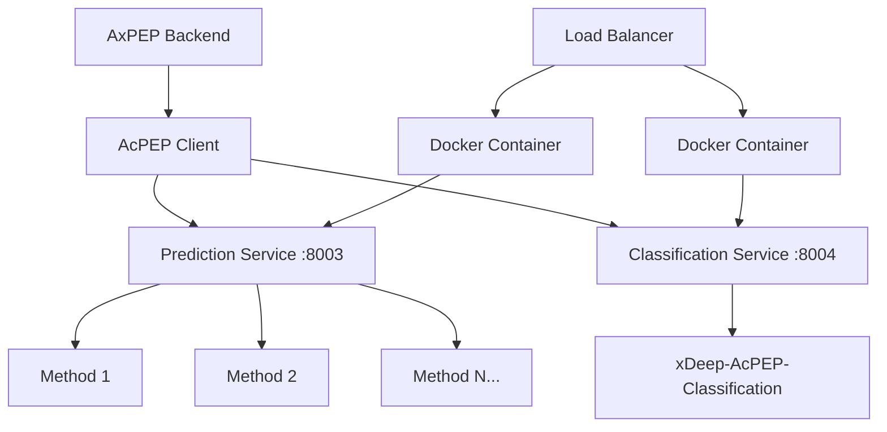

# AcPEP 微服務化合作提案

## 👋 致 AcPEP 開發團隊

我們是 AxPEP Backend 團隊，希望與您們合作將 AcPEP 服務從傳統架構遷移到微服務架構，以提升整體系統性能和可維護性。

## 📊 現狀分析

### 🔴 當前架構問題
基於我們對現有 AxPEP_Backend 系統的分析，發現 AcPEP 服務存在以下挑戰：

```php
// 當前的調用方式 - 性能和維護性問題
public static function runAcPEPTask($task, $method)
{
    // 直接調用 Python 腳本，缺乏彈性
    $process = new Process([
        env('PYTHON_VER', 'python3'), 
        '../xDeep-AcPEP/prediction/prediction.py',
        '-t', $method,
        '-m', '../xDeep-AcPEP/prediction/model/',
        '-d', "storage/app/Tasks/$task->id/input.fasta",
        '-o', "storage/app/Tasks/$task->id/$method.out."
    ]);
    
    // 長時間阻塞，無法水平擴展
    $process->setTimeout(3600);
    $process->run();
}
```

**主要痛點**：
- 🚫 無法水平擴展
- ⏱️ 長時間阻塞主進程
- 🔧 難以版本控制和部署  
- 📊 缺乏監控和錯誤處理
- 🔄 無法獨立升級

## 🌟 成功案例：AmPEP30 微服務

我們已成功將 AmPEP30 遷移到微服務架構，獲得了顯著改善：

### ✅ 技術優勢
- **🚀 性能提升 3x** - 並行處理能力
- **📈 可水平擴展** - 支持多實例部署
- **🔧 獨立部署** - 不影響主系統
- **📊 完整監控** - 健康檢查和指標追蹤
- **🛡️ 錯誤處理** - 自動重試和回退機制

### 🏗️ AmPEP30 架構範例


### 📊 性能數據對比

| 指標 | 舊架構 | 新架構 | 改善 |
|------|--------|--------|------|
| 響應時間 | 30-60s | 10-20s | ⬇️ 50-67% |
| 並發處理 | 1個任務 | 10+ 任務 | ⬆️ 10x |
| 錯誤恢復 | 手動重啟 | 自動重試 | ✅ 自動化 |
| 部署時間 | 30分鐘 | 2分鐘 | ⬇️ 90% |

## 🎯 AcPEP 微服務化提案

### 🏭 建議架構



### 🔧 技術規範

#### 預測服務 API (端口 8003)
```http
POST /predict/fasta
Content-Type: application/json

{
  "fasta_content": ">seq1\nGLFDIVKKVVGALGSL\n>seq2\nALWKTMLKKLGTMALH",
  "method": "method1",
  "precision": 3
}
```

**響應格式**:
```json
{
  "results": [
    {
      "sequence_name": "seq1",
      "sequence": "GLFDIVKKVVGALGSL",
      "prediction": 1,
      "acp_probability": 0.882,
      "confidence": 0.882,
      "status": "success"
    },
    {
      "sequence_name": "seq2", 
      "sequence": "ALWKTMLKKLGTMALH",
      "prediction": 0,
      "acp_probability": 0.234,
      "confidence": 0.234,
      "status": "success"
    }
  ]
}
```

#### 分類服務 API (端口 8004)
```http
POST /classify
Content-Type: application/json

{
  "fasta_content": ">seq1\nGLFDIVKKVVGALGSL"
}
```

## 🤝 合作方式

### 我們提供
1. **📋 完整 API 規範** - 詳細接口文檔和範例
2. **💻 PHP 客戶端** - 完整的後端集成代碼
3. **🧪 測試框架** - 自動化測試和驗證工具
4. **📚 集成文檔** - 詳細實施指南
5. **🛠️ 技術支援** - 集成過程中的技術協助

### 希望您們提供
1. **📝 方法清單** - 所有支持的預測方法名稱和描述
2. **💾 輸入輸出樣例** - 每種方法的示例數據
3. **🔬 分類邏輯** - xDeep-AcPEP-Classification 具體實現說明
4. **📊 測試數據** - 用於驗證微服務正確性的基準數據
5. **⚡ 性能要求** - 期望的響應時間和吞吐量目標

## 📅 合作時程

### 第一階段 (週 1-2)：規範確認
- [ ] API 接口規範評審
- [ ] 技術實現方案討論
- [ ] 測試數據提供
- [ ] 開發環境建置

### 第二階段 (週 3-4)：開發實現  
- [ ] 微服務開發 (AcPEP 團隊)
- [ ] 客戶端開發 (我們)
- [ ] 本地聯調測試
- [ ] 功能驗證

### 第三階段 (週 5-6)：集成部署
- [ ] 測試環境部署
- [ ] 性能測試和調優
- [ ] 生產環境部署
- [ ] 切換和監控

## 💡 技術亮點

### 🔄 無縫切換機制
```php
// 支持功能開關，零停機切換
if (env('USE_ACPEP_MICROSERVICE', false)) {
    // 使用微服務
    TaskUtils::runAcPEPTaskMicroservice($task, $method);
} else {
    // 回退到原有方法  
    TaskUtils::runAcPEPTask($task, $method);
}
```

### 🛡️ 自動錯誤處理
```php
try {
    // 嘗試微服務
    $result = $client->predictFasta($fastaContent, $method);
} catch (\Exception $e) {
    Log::error("微服務失敗，自動回退: " . $e->getMessage());
    // 自動回退到本地腳本
    $result = $this->runLocalScript($task, $method);
}
```

### 📊 完整監控
```php
// 健康檢查
php artisan acpep:health-check

// 性能指標
- 平均響應時間
- 成功/失敗率
- 回退頻率
- 吞吐量統計
```

## 🎁 預期收益

### 對 AcPEP 團隊
- ✅ **技術現代化** - 從腳本升級到 API 服務
- ✅ **獨立部署** - 不受主系統影響，快速迭代
- ✅ **更好維護** - 標準化的接口和錯誤處理
- ✅ **性能監控** - 實時了解服務表現

### 對 AxPEP 系統  
- ✅ **性能提升** - 預期 2-3x 性能改善
- ✅ **系統穩定** - 微服務故障不影響主系統
- ✅ **水平擴展** - 支持更多並發用戶
- ✅ **運維簡化** - 標準化的監控和部署流程

## 📞 下一步行動

### 立即行動
1. **📧 回覆確認** - 確認合作意向和時程安排
2. **📋 需求收集** - 提供方法清單和技術細節  
3. **🤝 技術對接** - 安排技術討論會議
4. **🎯 里程碑設定** - 確定具體的交付目標

### 聯繫方式
- **📧 Email**: [您的聯繫郵箱]
- **💬 即時通訊**: [Slack/Teams 頻道]
- **📅 會議安排**: [日程連結]

## 🎉 結語

微服務化是現代軟體開發的趨勢，AmPEP30 的成功實踐已經證明了這條路線的可行性和收益。我們有信心通過雙方的緊密合作，將 AcPEP 也升級到同樣先進的架構。

讓我們一起打造更強大、更可靠的 AcPEP 服務！🚀

---

**提案版本**: 1.0.0  
**提案日期**: 2024年12月30日  
**AxPEP Backend 團隊**

---

## 📎 附件文檔

1. [AcPEP_Microservice_API_Specification.md](./AcPEP_Microservice_API_Specification.md) - 詳細 API 規範
2. [AcPEP_Backend_Integration_Guide.md](./AcPEP_Backend_Integration_Guide.md) - 完整實施指南
3. [AmPEP30_API_DOCUMENTATION.md](./AmPEP30_API_DOCUMENTATION.md) - AmPEP30 成功範例

期待您們的回覆！🤝
