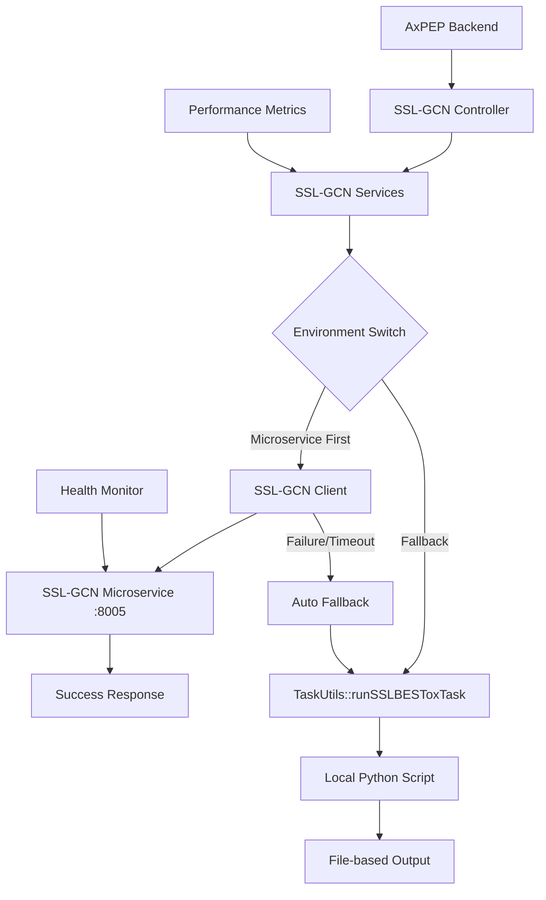

# SSL-GCN 後端整合指南

## 📋 概述

本指南詳細說明如何將 SSL-GCN 微服務整合到 AxPEP Backend 系統中，實現「微服務優先，本地腳本回退」的統一架構模式。

## 🎯 整合目標

- ✅ 實現與現有微服務架構的一致性
- ✅ 提供自動回退機制確保服務可靠性
- ✅ 支援環境開關便於部署和測試
- ✅ 完整的錯誤處理和監控
- ✅ 向後相容現有的 SSL-GCN 功能

## 🏗️ 整合架構



## 📁 檔案結構

整合後的檔案結構：
```
app/
├── Services/
│   └── SSLGCNMicroserviceClient.php     # 新增：微服務客戶端
├── Utils/
│   └── TaskUtils.php                    # 修改：加入微服務調用
├── Jobs/
│   └── SSLBESToxJob.php                 # 修改：整合環境開關
└── Http/Controllers/Apis/
    └── SSLBestoxController.php          # 保持不變
```

## 🔧 實作步驟

### 步驟 1：創建微服務客戶端

創建 `app/Services/SSLGCNMicroserviceClient.php`：

```php
<?php

namespace App\Services;

use GuzzleHttp\Client;
use GuzzleHttp\Exception\ConnectException;
use GuzzleHttp\Exception\RequestException;
use Illuminate\Support\Facades\Log;

class SSLGCNMicroserviceClient
{
    private $client;
    private $baseUrl;
    private $timeout;
    private $maxRetries;

    public function __construct()
    {
        $this->baseUrl = env('SSL_GCN_MICROSERVICE_BASE_URL', 'http://localhost:8005');
        $this->timeout = env('SSL_GCN_MICROSERVICE_TIMEOUT', 300);
        $this->maxRetries = env('SSL_GCN_MICROSERVICE_MAX_RETRIES', 3);
        
        $this->client = new Client([
            'timeout' => $this->timeout + 30, // 額外 30 秒緩衝
            'headers' => [
                'Content-Type' => 'application/json',
                'Accept' => 'application/json',
                'User-Agent' => 'AxPEP-Backend/1.0'
            ]
        ]);
    }

    /**
     * 預測蛋白質毒理學
     */
    public function predict($fastaContent, $method)
    {
        $retries = 0;
        
        while ($retries < $this->maxRetries) {
            try {
                Log::info("SSL-GCN微服務調用開始", [
                    'method' => $method,
                    'retry' => $retries,
                    'base_url' => $this->baseUrl
                ]);
                
                $response = $this->client->post('/predict/fasta', [
                    'json' => [
                        'fasta_content' => $fastaContent,
                        'method' => $this->mapMethod($method),
                        'precision' => 6,
                        'timeout' => $this->timeout,
                        'options' => [
                            'include_graph_features' => true,
                            'include_confidence' => true,
                            'batch_size' => 32
                        ]
                    ]
                ]);
                
                $result = json_decode($response->getBody(), true);
                
                if ($result['status'] === 'success') {
                    Log::info("SSL-GCN微服務調用成功", [
                        'method' => $method,
                        'processing_time' => $result['processing_time'] ?? 'unknown',
                        'sequences_processed' => count($result['results'] ?? [])
                    ]);
                    
                    return $result;
                } else {
                    throw new \Exception("微服務返回錯誤: " . ($result['error_message'] ?? 'Unknown error'));
                }
                
            } catch (ConnectException $e) {
                $retries++;
                Log::warning("SSL-GCN微服務連接失敗", [
                    'method' => $method,
                    'retry' => $retries,
                    'max_retries' => $this->maxRetries,
                    'error' => $e->getMessage()
                ]);
                
                if ($retries >= $this->maxRetries) {
                    throw new MicroserviceUnavailableException(
                        "SSL-GCN微服務在 {$this->maxRetries} 次重試後仍無法連接: " . $e->getMessage()
                    );
                }
                
                // 指數退避重試
                sleep(min(pow(2, $retries), 30));
                
            } catch (RequestException $e) {
                Log::error("SSL-GCN微服務請求失敗", [
                    'method' => $method,
                    'error' => $e->getMessage(),
                    'response' => $e->hasResponse() ? $e->getResponse()->getBody()->getContents() : null
                ]);
                
                throw new \Exception("SSL-GCN微服務請求失敗: " . $e->getMessage());
            }
        }
    }

    /**
     * 健康檢查
     */
    public function healthCheck()
    {
        try {
            $response = $this->client->get('/health', ['timeout' => 10]);
            $data = json_decode($response->getBody(), true);
            
            return [
                'available' => $data['status'] === 'healthy',
                'details' => $data
            ];
        } catch (\Exception $e) {
            Log::warning("SSL-GCN健康檢查失敗: " . $e->getMessage());
            return [
                'available' => false,
                'error' => $e->getMessage()
            ];
        }
    }

    /**
     * 方法名稱映射
     */
    private function mapMethod($method)
    {
        $methodMap = [
            'toxicity' => 'toxicity',
            'bioactivity' => 'bioactivity',
            // 根據實際 SSL-GCN 支援的方法進行映射
        ];
        
        return $methodMap[$method] ?? $method;
    }
}

/**
 * 微服務不可用異常
 */
class MicroserviceUnavailableException extends \Exception
{
    //
}
```

### 步驟 2：修改 TaskUtils

修改 `app/Utils/TaskUtils.php`，加入微服務調用邏輯：

```php
<?php

// 在 TaskUtils.php 中加入新方法

/**
 * 運行 SSL-GCN 任務（微服務優先）
 */
public static function runSSLGCNTaskMicroservice($task, $method)
{
    $useSSLGCNMicroservice = env('USE_SSL_GCN_MICROSERVICE', false);
    
    if ($useSSLGCNMicroservice) {
        try {
            Log::info("嘗試使用SSL-GCN微服務", [
                'task_id' => $task->id,
                'method' => $method
            ]);
            
            // 讀取 FASTA 文件
            $fastaPath = "storage/app/Tasks/{$task->id}/input.fasta";
            if (!file_exists($fastaPath)) {
                throw new \Exception("FASTA文件不存在: {$fastaPath}");
            }
            
            $fastaContent = file_get_contents($fastaPath);
            
            // 調用微服務
            $client = new \App\Services\SSLGCNMicroserviceClient();
            $result = $client->predict($fastaContent, $method);
            
            // 轉換結果格式並保存
            self::saveSSLGCNMicroserviceResult($task, $method, $result);
            
            Log::info("SSL-GCN微服務調用成功", [
                'task_id' => $task->id,
                'method' => $method,
                'sequences_processed' => count($result['results'] ?? [])
            ]);
            
            return true;
            
        } catch (\App\Services\MicroserviceUnavailableException $e) {
            Log::error("SSL-GCN微服務不可用，回退到本地腳本", [
                'task_id' => $task->id,
                'method' => $method,
                'error' => $e->getMessage()
            ]);
            
            // 自動回退到本地腳本
            return self::runSSLBESToxTask($task, $method);
            
        } catch (\Exception $e) {
            Log::error("SSL-GCN微服務調用失敗，回退到本地腳本", [
                'task_id' => $task->id,
                'method' => $method,
                'error' => $e->getMessage()
            ]);
            
            // 自動回退到本地腳本
            return self::runSSLBESToxTask($task, $method);
        }
    } else {
        Log::info("SSL-GCN微服務已停用，使用本地腳本", [
            'task_id' => $task->id,
            'method' => $method
        ]);
        
        // 直接使用本地腳本
        return self::runSSLBESToxTask($task, $method);
    }
}

/**
 * 保存微服務結果
 */
private static function saveSSLGCNMicroserviceResult($task, $method, $result)
{
    $outputPath = "storage/app/Tasks/{$task->id}/{$method}.";
    
    // 創建與本地腳本相容的輸出格式
    $outputContent = "";
    
    foreach ($result['results'] as $prediction) {
        $outputContent .= sprintf(
            "%s\t%s\t%.6f\t%.6f\n",
            $prediction['sequence_name'],
            $prediction['sequence'],
            $prediction['prediction'],
            $prediction['confidence'] ?? 1.0
        );
    }
    
    // 保存結果文件
    file_put_contents($outputPath, $outputContent);
    
    // 同時保存 JSON 格式的詳細結果
    $jsonPath = "storage/app/Tasks/{$task->id}/{$method}_microservice.json";
    file_put_contents($jsonPath, json_encode($result, JSON_PRETTY_PRINT));
    
    Log::info("SSL-GCN微服務結果已保存", [
        'task_id' => $task->id,
        'method' => $method,
        'output_path' => $outputPath,
        'json_path' => $jsonPath
    ]);
}
```

### 步驟 3：修改 SSL-GCN Job

修改 `app/Jobs/SSLBESToxJob.php`：

```php
<?php

namespace App\Jobs;

use App\Services\SSLBESToxServices;
use App\Utils\TaskUtils;
use Illuminate\Bus\Queueable;
use Illuminate\Contracts\Queue\ShouldQueue;
use Illuminate\Foundation\Bus\Dispatchable;
use Illuminate\Queue\InteractsWithQueue;
use Illuminate\Queue\SerializesModels;
use Illuminate\Support\Facades\Log;

class SSLBESToxJob implements ShouldQueue
{
    use Dispatchable, InteractsWithQueue, Queueable, SerializesModels;

    private $task;
    private $request;

    /**
     * 任務可以運行的秒數上限
     */
    public $timeout = 7200;

    public function __construct($task, $request)
    {
        $this->task = $task;
        $this->request = $request;
    }

    /**
     * 執行任務
     */
    public function handle()
    {
        try {
            foreach ($this->request['methods'] as $key => $value) {
                if ($value == true) {
                    Log::info("開始處理SSL-GCN任務", [
                        'task_id' => $this->task->id,
                        'method' => $key
                    ]);
                    
                    // 使用新的微服務優先方法
                    TaskUtils::runSSLGCNTaskMicroservice($this->task, $key);
                    
                    Log::info("SSL-GCN任務處理完成", [
                        'task_id' => $this->task->id,
                        'method' => $key
                    ]);
                }
            }
            
            SSLBESToxServices::getInstance()->finishedTask($this->task->id);
            
        } catch (\Exception $e) {
            Log::error('SSL-GCN任務失敗', [
                'task_id' => $this->task->id,
                'error' => $e->getMessage(),
                'trace' => $e->getTraceAsString()
            ]);
            
            SSLBESToxServices::getInstance()->failedTask($this->task->id);
            throw $e;
        }
    }

    /**
     * 任務失敗處理
     */
    public function failed(?\Throwable $exception = null)
    {
        Log::error('SSL-GCN任務失敗狀態', [
            'task_id' => $this->task->id,
            'error' => $exception ? $exception->getMessage() : 'Unknown error'
        ]);
        
        SSLBESToxServices::getInstance()->failedTask($this->task->id);
    }
}
```

### 步驟 4：環境變數配置

在 `.env` 文件中加入以下配置：

```bash
# SSL-GCN 微服務配置
USE_SSL_GCN_MICROSERVICE=false
SSL_GCN_MICROSERVICE_BASE_URL=http://localhost:8005
SSL_GCN_MICROSERVICE_TIMEOUT=300
SSL_GCN_MICROSERVICE_MAX_RETRIES=3

# SSL-GCN 微服務監控
SSL_GCN_HEALTH_CHECK_INTERVAL=300
SSL_GCN_PERFORMANCE_LOGGING=true
```

### 步驟 5：創建健康檢查命令

創建 `app/Console/Commands/SSLGCNHealthCheck.php`：

```php
<?php

namespace App\Console\Commands;

use App\Services\SSLGCNMicroserviceClient;
use Illuminate\Console\Command;

class SSLGCNHealthCheck extends Command
{
    protected $signature = 'ssl-gcn:health-check';
    protected $description = '檢查 SSL-GCN 微服務健康狀態';

    public function handle()
    {
        $this->info('檢查 SSL-GCN 微服務健康狀態...');
        
        try {
            $client = new SSLGCNMicroserviceClient();
            $health = $client->healthCheck();
            
            if ($health['available']) {
                $this->info('✅ SSL-GCN 微服務運行正常');
                
                if (isset($health['details'])) {
                    $details = $health['details'];
                    $this->line("版本: {$details['version']}");
                    $this->line("運行時間: {$details['system']['uptime']}");
                    $this->line("記憶體使用: {$details['system']['memory_usage']}");
                    $this->line("已處理請求: {$details['system']['requests_processed']}");
                }
            } else {
                $this->error('❌ SSL-GCN 微服務不可用');
                if (isset($health['error'])) {
                    $this->line("錯誤: {$health['error']}");
                }
                return 1;
            }
        } catch (\Exception $e) {
            $this->error('❌ 健康檢查失敗: ' . $e->getMessage());
            return 1;
        }
        
        return 0;
    }
}
```

在 `app/Console/Kernel.php` 中註冊命令：

```php
protected $commands = [
    Commands\SSLGCNHealthCheck::class,
];
```

## 🧪 測試指南

### 1. 單元測試

創建 `tests/Unit/SSLGCNMicroserviceClientTest.php`：

```php
<?php

namespace Tests\Unit;

use App\Services\SSLGCNMicroserviceClient;
use Tests\TestCase;
use Mockery;

class SSLGCNMicroserviceClientTest extends TestCase
{
    public function test_health_check_success()
    {
        // Mock 成功的健康檢查
        $client = new SSLGCNMicroserviceClient();
        // 測試邏輯...
    }
    
    public function test_predict_with_valid_fasta()
    {
        // 測試正常預測流程
        $client = new SSLGCNMicroserviceClient();
        $fasta = ">test\nGLFDIVKKVVGALGSL";
        // 測試邏輯...
    }
    
    public function test_fallback_on_microservice_failure()
    {
        // 測試回退機制
        // 測試邏輯...
    }
}
```

### 2. 整合測試

創建 `tests/Feature/SSLGCNIntegrationTest.php`：

```php
<?php

namespace Tests\Feature;

use Tests\TestCase;
use App\Models\Tasks;

class SSLGCNIntegrationTest extends TestCase
{
    public function test_ssl_gcn_task_with_microservice_enabled()
    {
        // 設定環境變數
        config(['app.USE_SSL_GCN_MICROSERVICE' => true]);
        
        // 創建測試任務
        $task = Tasks::factory()->create();
        
        // 測試完整流程
        // 測試邏輯...
    }
    
    public function test_ssl_gcn_task_with_microservice_disabled()
    {
        // 測試本地腳本模式
        config(['app.USE_SSL_GCN_MICROSERVICE' => false]);
        
        // 測試邏輯...
    }
}
```

### 3. 手動測試

```bash
# 健康檢查
php artisan ssl-gcn:health-check

# 測試 API 端點
curl -X POST http://localhost:8005/health
curl -X POST http://localhost:8005/predict/fasta \
  -H "Content-Type: application/json" \
  -d '{"fasta_content":">test\nGLFDIVKKVVGALGSL","method":"toxicity"}'
```

## 📊 監控和日誌

### 1. 日誌配置

在 `config/logging.php` 中加入 SSL-GCN 專用頻道：

```php
'channels' => [
    'ssl-gcn' => [
        'driver' => 'daily',
        'path' => storage_path('logs/ssl-gcn.log'),
        'level' => env('LOG_LEVEL', 'debug'),
        'days' => 14,
    ],
],
```

### 2. 性能監控

創建 `app/Services/SSLGCNMonitoringService.php`：

```php
<?php

namespace App\Services;

use Illuminate\Support\Facades\Cache;
use Illuminate\Support\Facades\Log;

class SSLGCNMonitoringService
{
    public static function recordRequest($method, $responseTime, $success = true)
    {
        $key = "ssl_gcn_stats_{$method}";
        $stats = Cache::get($key, [
            'total_requests' => 0,
            'successful_requests' => 0,
            'failed_requests' => 0,
            'total_response_time' => 0,
            'average_response_time' => 0
        ]);
        
        $stats['total_requests']++;
        $stats['total_response_time'] += $responseTime;
        $stats['average_response_time'] = $stats['total_response_time'] / $stats['total_requests'];
        
        if ($success) {
            $stats['successful_requests']++;
        } else {
            $stats['failed_requests']++;
        }
        
        Cache::put($key, $stats, 3600); // 1小時
        
        Log::channel('ssl-gcn')->info('SSL-GCN請求統計', [
            'method' => $method,
            'response_time' => $responseTime,
            'success' => $success,
            'stats' => $stats
        ]);
    }
    
    public static function getStats($method = null)
    {
        if ($method) {
            return Cache::get("ssl_gcn_stats_{$method}", []);
        }
        
        // 返回所有方法的統計
        $methods = ['toxicity', 'bioactivity'];
        $allStats = [];
        
        foreach ($methods as $method) {
            $allStats[$method] = Cache::get("ssl_gcn_stats_{$method}", []);
        }
        
        return $allStats;
    }
}
```

## 🚀 部署指南

### 1. 生產環境配置

```bash
# .env.production
USE_SSL_GCN_MICROSERVICE=true
SSL_GCN_MICROSERVICE_BASE_URL=https://ssl-gcn-api.axpep.com
SSL_GCN_MICROSERVICE_TIMEOUT=600
SSL_GCN_MICROSERVICE_MAX_RETRIES=5
```

### 2. 部署檢查清單

- [ ] SSL-GCN 微服務已部署並運行
- [ ] 健康檢查端點可訪問
- [ ] 環境變數正確配置
- [ ] 本地腳本作為回退方案可用
- [ ] 日誌和監控配置正確
- [ ] 測試用例全部通過

### 3. 滾動部署策略

1. **階段 1**: 部署微服務，但保持 `USE_SSL_GCN_MICROSERVICE=false`
2. **階段 2**: 在測試環境驗證微服務功能
3. **階段 3**: 逐步開啟微服務（如 10% 流量）
4. **階段 4**: 監控性能和錯誤率
5. **階段 5**: 完全切換到微服務

## 🔧 故障排除

### 常見問題

**Q: 微服務調用超時怎麼辦？**
A: 系統會自動回退到本地腳本，並記錄相關日誌。檢查微服務狀態和網絡連接。

**Q: 微服務返回錯誤結果？**
A: 檢查 FASTA 格式、序列長度和方法參數。查看微服務日誌獲取詳細錯誤信息。

**Q: 如何監控微服務性能？**
A: 使用 `SSLGCNMonitoringService::getStats()` 獲取統計信息，或查看日誌文件。

**Q: 如何快速切換到本地腳本？**
A: 設定 `USE_SSL_GCN_MICROSERVICE=false` 並重新啟動服務。

### 日誌分析

```bash
# 查看 SSL-GCN 相關日誌
tail -f storage/logs/ssl-gcn.log

# 搜索錯誤日誌
grep "ERROR" storage/logs/ssl-gcn.log

# 分析響應時間
grep "response_time" storage/logs/ssl-gcn.log | awk '{print $NF}'
```

## 📈 性能優化建議

1. **連接池**: 使用 HTTP 連接池減少連接開銷
2. **批量處理**: 合併多個序列到單個請求
3. **快取**: 快取頻繁請求的結果
4. **異步處理**: 使用隊列處理大量請求
5. **負載均衡**: 部署多個微服務實例

---

**文檔版本**: 1.0.0  
**最後更新**: 2024-12-30  
**維護團隊**: AxPEP Backend Team
