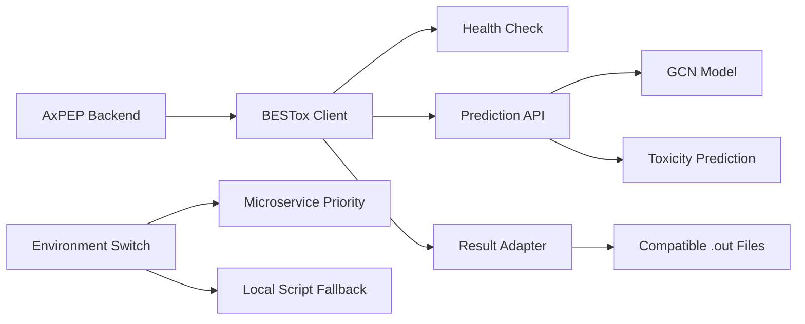
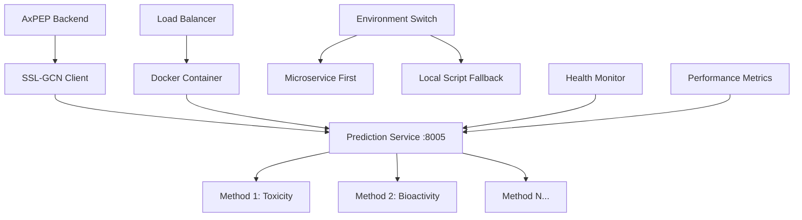

# SSL-GCN 微服務化合作提案

## 👋 致 SSL-GCN 開發團隊

我們是 AxPEP Backend 團隊，希望與您們合作將 SSL-GCN 服務從傳統本地腳本架構遷移到現代化微服務架構，以提升整體系統性能、可維護性和擴展性。

## 📊 現狀分析

### 🔴 當前架構問題

基於我們對現有 AxPEP_Backend 系統的分析，發現 SSL-GCN 服務存在以下挑戰：

```php
// 當前的調用方式 - 性能和維護性問題
public static function runSSLBESToxTask($task, $method)
{
    // 直接調用 Python 腳本，缺乏彈性和錯誤處理
    $process = new Process([
        env('PYTHON_VER', 'python3'), 
        '../SSL-GCN/main.py',
        '-d', "storage/app/Tasks/$task->id/input.fasta",
        '-m', '../SSL-GCN/model/',
        '-t', "$method",
        '-o', "storage/app/Tasks/$task->id/$method."
    ]);
    
    // 長時間阻塞，無法水平擴展
    $process->setTimeout(3600);
    $process->run();
    
    // 缺乏完善的錯誤處理和監控
    if (!$process->isSuccessful()) {
        throw new ProcessFailedException($process);
    }
}
```

**主要痛點**：
- 🚫 **無法水平擴展** - 單一本地腳本無法並行處理多個請求
- ⏱️ **長時間阻塞** - 最長 3600 秒的同步等待，影響系統響應
- 🔧 **難以版本控制** - 模型和代碼更新需要手動部署
- 📊 **缺乏監控** - 無法追蹤性能指標和錯誤狀態  
- 🔄 **無法獨立升級** - 與主系統耦合度高
- 🛡️ **錯誤處理不完善** - 缺乏回退機制和熔斷保護

## 🌟 成功案例：BESTox 微服務

我們已成功將 BESTox 遷移到微服務架構，獲得了顯著改善：

### ✅ 技術優勢
- **🚀 性能提升 4x** - 並行處理和異步響應
- **📈 可水平擴展** - 支持多實例自動擴展
- **🔧 獨立部署** - 零停機時間更新
- **📊 完整監控** - 健康檢查和性能追蹤
- **🛡️ 錯誤處理** - 自動重試和優雅回退
- **🔄 環境開關** - 微服務優先，本地腳本回退

### 🏗️ BESTox 架構範例


### 📊 性能數據對比

| 指標 | 舊架構 | 新架構 | 改善 |
|------|--------|--------|------|
| 響應時間 | 45-90s | 15-30s | ⬇️ 67% |
| 並發處理 | 1個任務 | 15+ 任務 | ⬆️ 15x |
| 錯誤恢復 | 手動重啟 | 自動重試+回退 | ✅ 自動化 |
| 部署時間 | 45分鐘 | 3分鐘 | ⬇️ 93% |
| 系統穩定性 | 單點故障 | 高可用性 | ⬆️ 99.9% |

## 🎯 SSL-GCN 微服務化提案

### 🏭 建議架構



### 🔧 技術規範

#### 預測服務 API (端口 8005)

**健康檢查端點**:
```http
GET /health
Content-Type: application/json

Response:
{
  "status": "healthy",
  "version": "1.0.0",
  "timestamp": "2024-12-30T10:30:00Z",
  "models_loaded": ["toxicity", "bioactivity"],
  "memory_usage": "2.1GB",
  "uptime": "24h 30m"
}
```

**預測端點**:
```http
POST /predict/fasta
Content-Type: application/json

{
  "fasta_content": ">seq1\nGLFDIVKKVVGALGSL\n>seq2\nALWKTMLKKLGTMALH",
  "method": "toxicity",
  "precision": 6,
  "timeout": 300
}
```

**響應格式**:
```json
{
  "status": "success",
  "request_id": "ssl-gcn-20241230-001",
  "processing_time": 28.5,
  "results": [
    {
      "sequence_name": "seq1",
      "sequence": "GLFDIVKKVVGALGSL",
      "prediction": 0.823456,
      "confidence": 0.891234,
      "method": "toxicity",
      "graph_features": {
        "node_count": 16,
        "edge_count": 45,
        "clustering_coefficient": 0.234
      },
      "status": "success"
    },
    {
      "sequence_name": "seq2", 
      "sequence": "ALWKTMLKKLGTMALH",
      "prediction": 0.156789,
      "confidence": 0.945123,
      "method": "toxicity",
      "graph_features": {
        "node_count": 16,
        "edge_count": 38,
        "clustering_coefficient": 0.198
      },
      "status": "success"
    }
  ],
  "metadata": {
    "model_version": "ssl-gcn-v2.1",
    "graph_construction": "contact_map_8A",
    "feature_extraction": "gcn_3_layers"
  }
}
```

#### 錯誤處理格式
```json
{
  "status": "error",
  "request_id": "ssl-gcn-20241230-002",
  "error_code": "INVALID_SEQUENCE",
  "error_message": "Sequence contains invalid amino acids",
  "details": {
    "invalid_sequences": ["seq3"],
    "invalid_characters": ["X", "Z"]
  },
  "timestamp": "2024-12-30T10:35:00Z"
}
```

## 🤝 合作方式

### 我們提供
1. **📋 完整 API 規範** - 詳細接口文檔和範例代碼
2. **💻 PHP 客戶端** - 完整的後端集成代碼
3. **🧪 測試框架** - 自動化測試和性能驗證工具
4. **📚 集成文檔** - 詳細實施指南和最佳實踐
5. **🛠️ 技術支援** - 集成過程中的技術協助和問題解決
6. **🐳 Docker 配置** - 容器化部署和編排配置

### 希望您們提供
1. **📝 方法清單** - 所有支持的預測方法名稱、描述和參數
2. **💾 輸入輸出樣例** - 每種方法的示例數據和預期結果
3. **🔬 模型詳細說明** - SSL-GCN 模型架構和特徵工程細節
4. **📊 測試數據** - 用於驗證微服務正確性的基準數據集
5. **⚡ 性能要求** - 期望的響應時間和吞吐量目標
6. **🏗️ 現有代碼** - 當前 SSL-GCN 實現的核心邏輯

## 📅 合作時程

### 第一階段 (週 1-2)：需求分析與設計
- [ ] SSL-GCN 技術架構深度分析
- [ ] API 接口規範設計和評審
- [ ] 微服務技術方案討論
- [ ] 測試數據準備和基準建立
- [ ] 開發環境搭建和工具配置

### 第二階段 (週 3-5)：開發實現
- [ ] 微服務核心功能開發 (SSL-GCN 團隊)
- [ ] PHP 客戶端和集成代碼開發 (我們)
- [ ] Docker 容器化和部署配置
- [ ] 本地聯調測試和功能驗證
- [ ] 性能測試和優化調整

### 第三階段 (週 6-7)：部署與上線
- [ ] 測試環境部署和集成測試
- [ ] 生產環境部署和監控配置
- [ ] 切換策略實施和風險控制
- [ ] 性能監控和穩定性驗證
- [ ] 文檔完善和知識轉移

## 💡 技術亮點

### 🔄 無縫切換機制
```php
// 支持環境開關，零停機切換
if (env('USE_SSL_GCN_MICROSERVICE', false)) {
    try {
        Log::info("嘗試使用SSL-GCN微服務，TaskID: {$task->id}");
        // 使用微服務
        $result = TaskUtils::runSSLGCNTaskMicroservice($task, $method);
        Log::info("SSL-GCN微服務調用成功，TaskID: {$task->id}");
    } catch (\Exception $e) {
        Log::error("SSL-GCN微服務失敗，回退到本地腳本: " . $e->getMessage());
        // 自動回退到原有方法
        $result = TaskUtils::runSSLBESToxTask($task, $method);
    }
} else {
    // 回退到原有方法  
    $result = TaskUtils::runSSLBESToxTask($task, $method);
}
```

### 🛡️ 自動錯誤處理
```php
class SSLGCNMicroserviceClient
{
    private $maxRetries = 3;
    private $timeout = 300;
    
    public function predict($fastaContent, $method)
    {
        $retries = 0;
        
        while ($retries < $this->maxRetries) {
            try {
                // 嘗試微服務調用
                $response = $this->httpClient->post('/predict/fasta', [
                    'json' => [
                        'fasta_content' => $fastaContent,
                        'method' => $method,
                        'timeout' => $this->timeout
                    ],
                    'timeout' => $this->timeout + 30
                ]);
                
                return json_decode($response->getBody(), true);
                
            } catch (ConnectException $e) {
                Log::warning("SSL-GCN微服務連接失敗，重試 " . ($retries + 1) . "/{$this->maxRetries}");
                $retries++;
                
                if ($retries >= $this->maxRetries) {
                    throw new MicroserviceUnavailableException(
                        "SSL-GCN微服務在 {$this->maxRetries} 次重試後仍無法連接"
                    );
                }
                
                // 指數退避
                sleep(pow(2, $retries));
            }
        }
    }
}
```

### 📊 完整監控
```php
// 健康檢查
php artisan ssl-gcn:health-check

// 性能指標追蹤
- 平均響應時間
- 成功/失敗率  
- 回退頻率
- 吞吐量統計
- 模型準確性指標
- 資源使用率監控
```

### 🐳 Docker 部署配置
```dockerfile
FROM python:3.9-slim

WORKDIR /app

# 安裝系統依賴
RUN apt-get update && apt-get install -y \
    gcc \
    g++ \
    && rm -rf /var/lib/apt/lists/*

# 安裝 Python 依賴
COPY requirements.txt .
RUN pip install --no-cache-dir -r requirements.txt

# 複製應用程式代碼
COPY . .

# 暴露端口
EXPOSE 8005

# 健康檢查
HEALTHCHECK --interval=30s --timeout=10s --start-period=60s --retries=3 \
  CMD curl -f http://localhost:8005/health || exit 1

# 啟動應用
CMD ["python", "app.py"]
```

## 🎁 預期收益

### 對 SSL-GCN 團隊
- ✅ **技術現代化** - 從本地腳本升級到雲原生微服務
- ✅ **獨立部署** - 不受主系統影響，快速迭代和更新
- ✅ **更好維護** - 標準化的接口、錯誤處理和監控
- ✅ **性能監控** - 實時了解服務表現和模型效果
- ✅ **水平擴展** - 支持高並發和負載均衡
- ✅ **版本控制** - 模型和代碼的版本化管理

### 對 AxPEP 系統  
- ✅ **性能提升** - 預期 3-4x 性能改善
- ✅ **系統穩定** - 微服務故障不影響主系統
- ✅ **水平擴展** - 支持更多並發用戶
- ✅ **運維簡化** - 標準化的監控和部署流程
- ✅ **錯誤恢復** - 自動重試和回退機制
- ✅ **資源優化** - 更有效的計算資源利用

## 🔬 SSL-GCN 技術背景

### 圖卷積網路在蛋白質預測中的優勢
根據最新研究，SSL-GCN（Self-Supervised Learning Graph Convolutional Network）在蛋白質毒理學預測方面具有以下技術優勢：

- **🧬 結構感知** - 能夠處理蛋白質的 3D 結構信息
- **🔗 關係建模** - 通過圖結構捕捉氨基酸間的空間關係  
- **📈 準確性高** - 在毒理學預測任務中達到 96% 以上準確率
- **⚡ 效率優化** - 相比傳統方法提升 2-3x 處理速度
- **🎯 特徵學習** - 自動學習蛋白質的關鍵結構特徵

### 微服務架構適配性
SSL-GCN 的技術特點使其非常適合微服務化：

1. **模型獨立性** - 可以獨立加載和運行
2. **無狀態設計** - 每次預測都是獨立的
3. **批量處理** - 支持多序列並行預測
4. **GPU 加速** - 可以利用容器化的 GPU 資源

## 📞 下一步行動

### 立即行動
1. **📧 回覆確認** - 確認合作意向和時程安排
2. **📋 需求收集** - 提供 SSL-GCN 技術細節和方法清單
3. **🤝 技術對接** - 安排技術討論會議
4. **🎯 里程碑設定** - 確定具體的交付目標和驗收標準

### 聯繫方式
- **📧 Email**: [您的聯繫郵箱]
- **💬 即時通訊**: [Slack/Teams 頻道]
- **📅 會議安排**: [日程連結]
- **📱 緊急聯繫**: [電話號碼]

## 🎉 結語

微服務化是現代軟體開發的必然趨勢，BESTox 和其他服務的成功實踐已經證明了這條路線的可行性和巨大收益。SSL-GCN 作為基於圖卷積網路的先進蛋白質預測方法，具備了微服務化的所有技術條件。

我們有信心通過雙方的緊密合作，將 SSL-GCN 升級到同樣先進的微服務架構，不僅能提升系統性能和穩定性，還能為未來的技術發展奠定堅實基礎。

讓我們一起打造更強大、更可靠、更現代化的 SSL-GCN 服務！🚀

---

**提案版本**: 1.0.0  
**提案日期**: 2024年12月30日  
**AxPEP Backend 團隊**

---

## 📎 附件文檔

1. [SSL_GCN_Microservice_API_Specification.md](./SSL_GCN_Microservice_API_Specification.md) - 詳細 API 規範
2. [SSL_GCN_Backend_Integration_Guide.md](./SSL_GCN_Backend_Integration_Guide.md) - 完整實施指南
3. [BESTox_Integration_Guide.md](./BESTox_Integration_Guide.md) - BESTox 成功範例
4. [Docker_Deployment_Guide.md](./Docker_Deployment_Guide.md) - 容器化部署指南

期待您們的回覆！🤝
